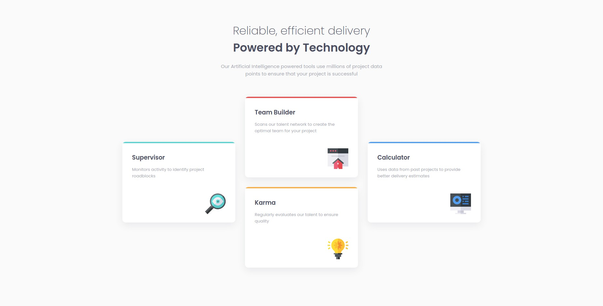

# Frontend Mentor - Four card feature section solution

This is a solution to the [Four card feature section challenge on Frontend Mentor](https://www.frontendmentor.io/challenges/four-card-feature-section-weK1eFYK).

## Overview

### The challenge

Users should be able to:

- View the optimal layout for the site depending on their device's screen size

### Screenshot

### Links

- Solution URL: [GitHub](https://github.com/Adilsongb/four-card-feature-section)
- Live Site URL: [Vercel](https://four-card-feature-section-three-sage.vercel.app/)

## My process

### Built with

- Semantic HTML5 markup
- CSS custom properties
- Flexbox
- Mobile-first workflow

## Author

- Frontend Mentor - [@Adilsongb](https://www.frontendmentor.io/profile/Adilsongb)
- Twitter - [@_adilsongb](https://twitter.com/_adilsongb)